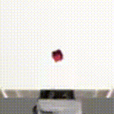
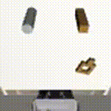

# Diffusion Policy for Robotic Manipulation

A PyTorch implementation of [Diffusion Policy](https://diffusion-policy.cs.columbia.edu/) using a Diffusion Transformer (DiT) architecture for robotic manipulation tasks in [robosuite](https://robosuite.ai/).

## Results

Evaluation results on robosuite manipulation tasks (20 episodes each):

| Task | Success Rate | Avg Steps | Status |
|------|-------------|-----------|--------|
| **Can (PickPlaceCan)** | **100%** | 152 | ✅ Solved |
| **Lift** | **85%** | 206 | ✅ Solved |
| **Square (NutAssembly)** | **25%** | 433 | ⚠️ Hard task |

### Demo Videos

| Lift (85% Success) | PickPlaceCan (100% Success) | NutAssemblySquare (25% Success) |
|:------------------:|:---------------------------:|:-------------------------------:|
|  |  |  |

*GIFs show successful rollouts from our trained DiT-based Diffusion Policy.*

## Architecture

This implementation uses a **Diffusion Transformer (DiT)** architecture inspired by [NVIDIA GROOT](https://github.com/NVIDIA/Isaac-GR00T). Key features:

- **DDPM** diffusion with cosine noise schedule
- **Cross-attention conditioning** on observations (all layers)
- **Multi-frame observation history** with learned temporal embeddings
- **AdaLN-Zero** output blocks for timestep conditioning

### Model Configuration

| Parameter | Value |
|-----------|-------|
| Hidden dimension | 512 |
| Transformer layers | 16 |
| Attention heads | 8 |
| Observation horizon | 4 frames |
| Action horizon | 16 steps |
| Diffusion steps | 100 |

## Installation

**Requirements:** Python ≥ 3.12

```bash
# Clone the repository
git clone https://github.com/your-username/diffusion-policy.git
cd diffusion-policy

# Install with uv (recommended)
uv sync

# Or with pip
pip install -e .
```

### Dataset Setup

This project uses demonstration data in [robomimic](https://robomimic.github.io/) HDF5 format. Download the datasets:

```bash
# Download robomimic datasets (requires robomimic installed)
python -m robomimic.scripts.download_datasets --tasks lift can square

# Convert to the required format (if needed)
python -m robomimic.scripts.conversion.convert_robosuite --dataset path/to/dataset.hdf5
```

Place the converted HDF5 files in the `data/` directory:
- `data/lift_converted.hdf5`
- `data/can_converted.hdf5`
- `data/square_converted.hdf5`

## Training

Train a diffusion policy on a robosuite task:

```bash
# Basic training
python main.py train --task can --data-path data/can_converted.hdf5 --epochs 100

# Full configuration
python main.py train \
    --task can \
    --data-path data/can_converted.hdf5 \
    --epochs 100 \
    --batch-size 32 \
    --lr 1e-4 \
    --hidden-dim 512 \
    --n-layers 16 \
    --obs-horizon 4 \
    --pred-horizon 16 \
    --checkpoint-dir checkpoints
```

### Training on Modal (Cloud GPUs)

For faster training on cloud GPUs via [Modal](https://modal.com/):

```bash
python main.py train --task can --data-path data/can_converted.hdf5 --modal
```

Checkpoints are saved to `checkpoints/policy_{task}_best.pt`.

## Evaluation

Evaluate a trained policy:

```bash
# Basic evaluation
python main.py evaluate --checkpoint checkpoints/policy_can_best.pt --task can --n-episodes 50

# With video recording
python main.py evaluate \
    --checkpoint checkpoints/policy_can_best.pt \
    --task can \
    --n-episodes 50 \
    --save-videos \
    --n-videos 5 \
    --video-dir eval_videos

# Enable debug logging
python main.py evaluate --checkpoint checkpoints/policy_can_best.pt --task can --debug
```

Evaluation metrics are saved to `eval_results/metrics.json`.

## Project Structure

```
diffusion-policy/
├── main.py              # CLI entry point (train/evaluate commands)
├── policy.py            # DiffusionPolicy and DiT model implementation
├── data/
│   ├── dataset.py       # RobomimicDataset loader and normalization
│   └── *.hdf5           # Demonstration data files
├── envs/
│   └── robosuite_wrapper.py  # Robosuite environment wrapper
├── eval/
│   └── evaluate.py      # PolicyEvaluator and metrics
├── train_modal.py       # Modal cloud training script
├── eval_modal.py        # Modal cloud evaluation script
├── EXPERIMENTS.md       # Detailed experiment logs and ablations
└── checkpoints/         # Saved model checkpoints
```

## Citation

If you use this code, please cite the original Diffusion Policy paper:

```bibtex
@inproceedings{chi2023diffusionpolicy,
    title={Diffusion Policy: Visuomotor Policy Learning via Action Diffusion},
    author={Chi, Cheng and Feng, Siyuan and Du, Yilun and Xu, Zhenjia and Cousineau, Eric and Burchfiel, Benjamin and Song, Shuran},
    booktitle={Proceedings of Robotics: Science and Systems (RSS)},
    year={2023}
}
```

## Acknowledgments

- [Diffusion Policy](https://diffusion-policy.cs.columbia.edu/) - Original paper and concept
- [robosuite](https://robosuite.ai/) - Simulation environments
- [robomimic](https://robomimic.github.io/) - Dataset format and benchmarks
- [Hugging Face Diffusers](https://github.com/huggingface/diffusers) - Diffusion model components
